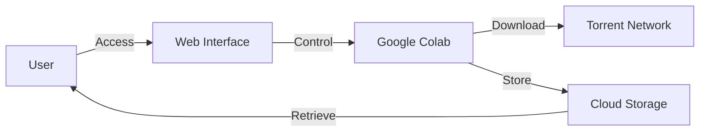

# CloudLeecher

<div align="center">


**A free, open-source solution that leverages Google's cloud infrastructure for torrent downloading, preserving your hardware while maximizing cloud resources.**

[](https://github.com/heavens7above/CloudLeecher/stargazers)
[](https://github.com/heavens7above/CloudLeecher/network/members)
[](LICENSE)

[🚀 **Launch CloudLeecher**](https://cloudleecher.web.app/) • [📓 **Open Colab Notebook**](https://colab.research.google.com/drive/1j-L-CXE-ObYWZ-_qGv0uNlpRsS3HPQSE?usp=sharing) • [📖 **Documentation**](https://github.com/heavens7above/CloudLeecher/blob/main/README.md)

</div>

---

## 🌟 Overview

CloudLeecher is an innovative cloud-based torrent downloading solution that harnesses the power of Google Colab's infrastructure. By offloading resource-intensive torrent downloads to Google's servers, you can preserve your local hardware, avoid bandwidth throttling, and enjoy fast, reliable downloads without wearing down your personal devices.

### ✨ Key Features

- **🌐 Cloud-Powered Downloads**: Leverage Google Colab's infrastructure for torrent downloading
- **💻 Hardware Preservation**: Save your local machine from wear and tear
- **⚡ High-Speed Transfers**: Take advantage of Google's fast network infrastructure
- **🎯 Easy to Use**: Simple web interface for managing downloads
- **🔒 Privacy Focused**: Your downloads remain isolated in the cloud environment
- **💰 100% Free**: No subscriptions, no hidden costs
- **🛠️ Open Source**: Fully transparent and community-driven

---

## 🎯 Why CloudLeecher?

Traditional torrent downloading puts significant strain on your local hardware and network:

- **Hardware Wear**: Constant disk writes and network activity degrade components
- **Bandwidth Consumption**: Downloads compete with other network activities
- **Power Usage**: Your machine must remain on during downloads
- **Privacy Concerns**: Your IP address is exposed to the torrent swarm

CloudLeecher solves these problems by moving the entire process to the cloud, letting Google's infrastructure handle the heavy lifting while you maintain control through a simple web interface.

---

## 🚀 Getting Started

### Prerequisites

- A Google account (for Google Colab access)
- A modern web browser
- Basic understanding of torrenting concepts

### Quick Start

1. **Visit the Web Interface**
   
   Navigate to [cloudleecher.web.app](https://cloudleecher.web.app/) to access the CloudLeecher dashboard.

2. **Open the Colab Notebook**
   
   Click the "Open Colab Notebook" button or visit the [Direct Link](https://colab.research.google.com/drive/1j-L-CXE-ObYWZ-_qGv0uNlpRsS3HPQSE?usp=sharing).

3. **Connect to Runtime**
   
   In Google Colab, connect to a runtime by clicking the "Connect" button in the top-right corner.

4. **Run the Setup Cells**
   
   Execute the notebook cells in sequence to initialize CloudLeecher.

5. **Start Downloading**
   
   Use the interface to add torrents via magnet links or .torrent files.

---

## 📁 Repository Structure

```
CloudLeecher/
│
├── frontend/                 # Web interface source code
│   ├── src/                 # Frontend application source
│   ├── public/              # Static assets
│   └── package.json         # Frontend dependencies
│
├── CloudLeecher.ipynb       # Main Google Colab notebook
├── README.md                # README.md
├── .gitignore              # Git ignore rules
└── LICENSE                 # License information
```

---

## 🔧 How It Works

CloudLeecher operates through a seamless integration of cloud computing and web technologies:



1. **User Interface**: Access CloudLeecher through the web-based dashboard
2. **Colab Backend**: Google Colab notebook handles torrent client operations
3. **Torrent Network**: Downloads are performed using cloud resources
4. **Cloud Storage**: Files are temporarily stored in Google's infrastructure
5. **File Retrieval**: Download completed files directly to your device

---

## 💡 Use Cases

### Perfect For:

- **💾 Large File Downloads**: Download large files without straining local resources
- **🌍 Remote Access**: Access your downloads from anywhere with internet
- **🔄 Multiple Downloads**: Queue multiple torrents without local hardware limitations
- **⏰ Scheduled Downloads**: Set up downloads to run without keeping your machine on
- **🎓 Students**: Utilize free cloud resources for legitimate content
- **🌐 Limited Bandwidth**: Offload bandwidth-heavy operations to the cloud

---

## ⚙️ Advanced Configuration

### Customizing the Notebook

The `CloudLeecher.ipynb` notebook can be customized for your specific needs:

- **Download Location**: Configure where files are stored
- **Torrent Client Settings**: Adjust bandwidth limits, connection limits, etc.
- **Authentication**: Set up secure access to your downloads
- **Notifications**: Enable alerts when downloads complete

### Frontend Customization

The web interface is built with modern web technologies and can be customized:

```bash
cd frontend
npm install
npm run dev
```

---

## 🛡️ Security & Privacy

CloudLeecher takes your security seriously:

- **🔐 Isolated Environment**: Each Colab session is isolated
- **🚫 No Data Persistence**: Sessions are temporary by default
- **🔒 Secure Connections**: All communications use HTTPS
- **👤 User Control**: You maintain full control over your data

**Important**: Always respect copyright laws and only download content you have the right to access.

---

## 📊 Performance

CloudLeecher leverages Google's infrastructure to provide:

- **Download Speeds**: Up to 100+ Mbps depending on torrent health
- **Storage**: Temporary storage up to available session limits
- **Session Duration**: Standard Colab sessions last several hours
- **Concurrent Downloads**: Multiple torrents can be managed simultaneously

---

## 🤝 Contributing

We welcome contributions from the community! Here's how you can help:

### Ways to Contribute

1. **🐛 Report Bugs**: Open an issue describing the bug
2. **💡 Suggest Features**: Share your ideas for improvements
3. **📝 Documentation**: Help improve or translate documentation
4. **💻 Code**: Submit pull requests with bug fixes or new features
5. **⭐ Star**: Give the project a star to show your support

### Development Setup

```bash
# Clone the repository
git clone https://github.com/heavens7above/CloudLeecher.git

# Navigate to the frontend directory
cd CloudLeecher/frontend

# Install dependencies
npm install

# Start development server
npm run dev
```

### Contribution Guidelines

- Follow the existing code style
- Write clear commit messages
- Test your changes thoroughly
- Update documentation as needed
- Be respectful and constructive

---

## 📝 License

This project is licensed under the MIT License - see the [LICENSE](LICENSE) file for details.

---

## 🙏 Acknowledgments

- **Google Colab**: For providing free cloud computing resources
- **Torrent Community**: For the open-source torrent client technologies
- **Contributors**: Everyone who has contributed to making CloudLeecher better

---

## 📞 Support & Community

### Get Help

- **📧 Issues**: Report bugs or request features via [GitHub Issues](https://github.com/heavens7above/CloudLeecher/issues)
- **💬 Discussions**: Join conversations in [GitHub Discussions](https://github.com/heavens7above/CloudLeecher/discussions)
- **📖 Documentation**: Check the docs for detailed guides

### Stay Updated

- **⭐ Star** the repository to receive updates
- **👀 Watch** for new releases and announcements
- **🔔 Follow** for project news

---

## ⚠️ Disclaimer

CloudLeecher is provided as-is for educational and legitimate purposes only. Users are responsible for ensuring their use complies with applicable laws and regulations. The developers of CloudLeecher do not condone or support copyright infringement or illegal file sharing.

Always respect copyright laws and content creators' rights. Only download content you have permission to access.

---

## 🗺️ Roadmap

### Current Version Features
- ✅ Basic torrent downloading via Google Colab
- ✅ Web interface for management
- ✅ File retrieval system

### Planned Features
- 🔄 Enhanced user authentication
- 📊 Download statistics and analytics
- 🔔 Email/push notifications
- 📱 Mobile app support
- 🗂️ Advanced file management
- 🤝 Multi-user support
- 🎨 Theme customization

---

## 📈 Statistics

<div align="center">


</div>

---

## 🌐 Links

- **Website**: [cloudleecher.web.app](https://cloudleecher.web.app/)
- **Colab Notebook**: [Open in Colab](https://colab.research.google.com/drive/1j-L-CXE-ObYWZ-_qGv0uNlpRsS3HPQSE?usp=sharing)
- **GitHub Repository**: [github.com/heavens7above/CloudLeecher](https://github.com/heavens7above/CloudLeecher)

---

<div align="center">

**If you find this project useful, consider giving it a ⭐!**

PEACE OUT

[⬆ Back to Top](#cloudleecher)

</div>