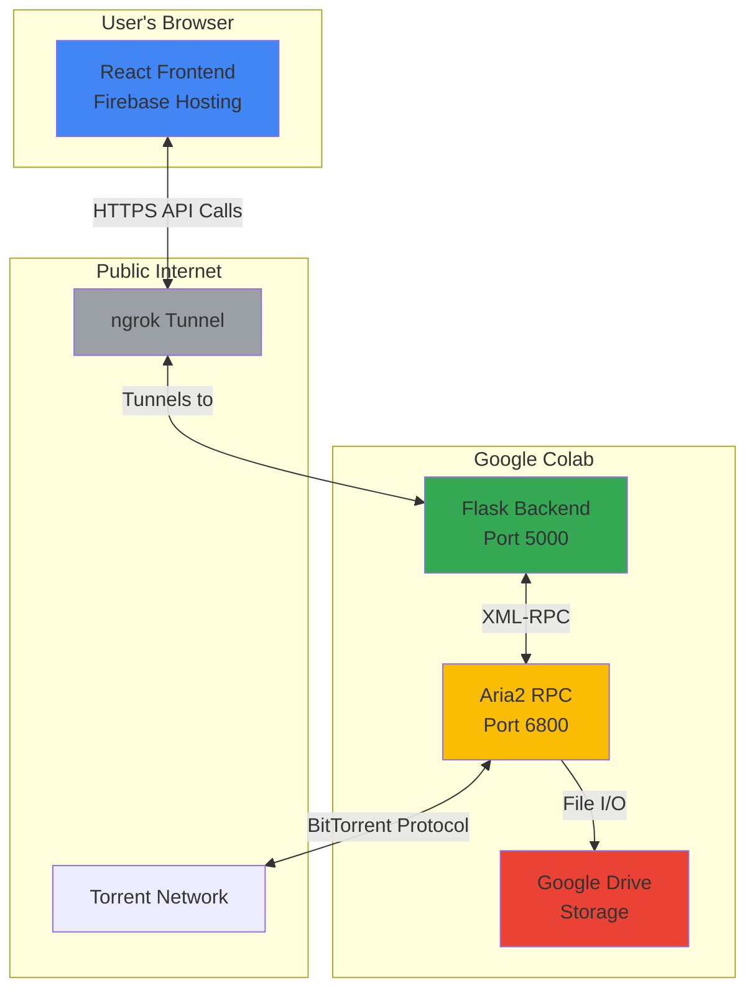
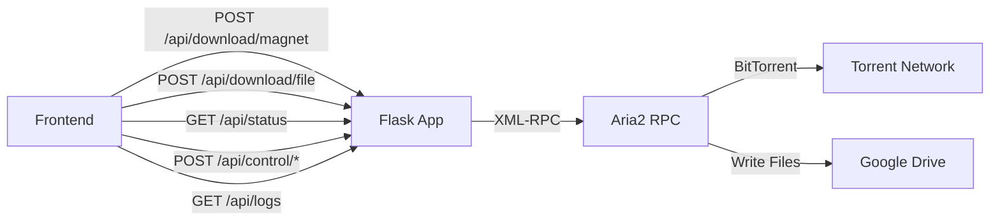
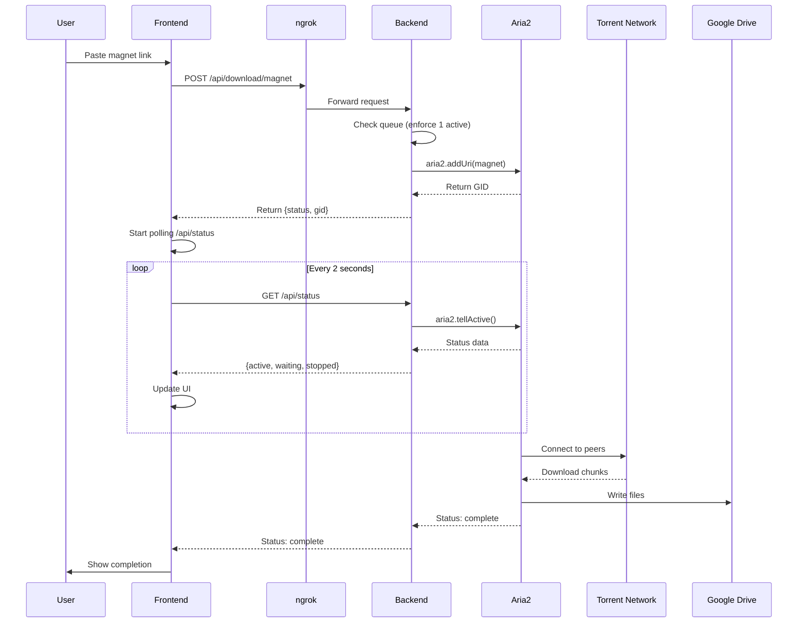
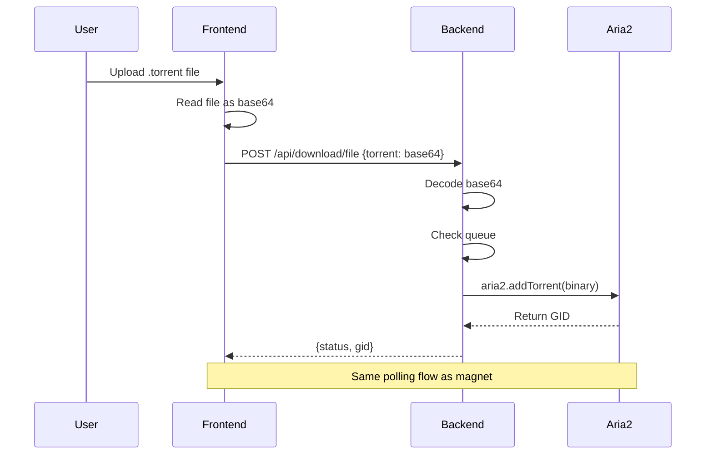

# Architecture Overview

This document provides a comprehensive overview of CloudLeecher's architecture, design decisions, and technical implementation.

## System Architecture

CloudLeecher is designed as a distributed system with three main components:



## Component Architecture

### 1. Frontend (React Application)

**Technology Stack:**
- React 19.2.0
- Vite (Build Tool)
- TailwindCSS (Styling)
- Axios (HTTP Client)
- React Router DOM (Routing)
- Lucide React (Icons)

**Key Features:**
- Real-time status updates via polling
- File upload support (.torrent files)
- Magnet link support
- Backend health monitoring
- Task management (pause, resume, remove)
- Backend logs viewer
- Responsive mobile-first design

**Architecture Pattern:**
- Context API for state management (`AppContext`, `ToastContext`)
- Component-based architecture
- Feature-based folder structure
- Service layer for API abstraction

**File Structure:**
```
frontend/src/
├── App.jsx                 # Main app component
├── main.jsx               # Entry point
├── index.css             # Global styles
├── components/           # Reusable UI components
│   ├── layout/          # Layout components (Header)
│   └── ui/              # UI primitives (Button, Card, Input, Progress)
├── context/             # React Context providers
│   ├── AppContext.jsx   # App state and API URL management
│   └── ToastContext.jsx # Toast notification system
├── features/            # Feature modules
│   ├── downloads/       # Download management
│   │   ├── TorrentInput.jsx
│   │   └── TaskList.jsx
│   └── logs/           # Backend logs
│       └── BackendLogs.jsx
└── services/           # API layer
    └── api.js         # Axios instance and API methods
```

### 2. Backend (Flask API Server)

**Technology Stack:**
- Python 3.x
- Flask (Web Framework)
- Flask-CORS (Cross-Origin Support)
- Aria2c (Download Engine)
- xmlrpc.client (Aria2 RPC Communication)
- pyngrok (Public URL Generation)

**Core Responsibilities:**
- Torrent management via Aria2 RPC
- REST API endpoints for frontend
- Queue enforcement (one download at a time)
- GID transition tracking
- Logging and monitoring
- Google Drive integration

**API Architecture:**



**Endpoints:**
- `GET /health` - Health check
- `GET /api/logs` - Backend logs
- `POST /api/download/magnet` - Add magnet link
- `POST /api/download/file` - Add .torrent file
- `GET /api/status` - Get download status
- `POST /api/control/pause` - Pause download
- `POST /api/control/resume` - Resume download
- `POST /api/control/remove` - Remove download
- `GET /api/drive/info` - Drive storage info
- `POST /api/cleanup` - Remove all tasks

### 3. Download Engine (Aria2)

**Configuration:**
```bash
aria2c --enable-rpc \
       --rpc-listen-all=true \
       --rpc-allow-origin-all \
       --dir=/content/drive/MyDrive/TorrentDownloads \
       --file-allocation=none \
       --max-connection-per-server=16 \
       --split=16 \
       --min-split-size=1M \
       --seed-time=0 \
       --daemon=true
```

**Key Features:**
- XML-RPC interface on port 6800
- Multi-connection downloading (16 connections per server)
- File splitting for faster downloads
- No seeding (seed-time=0) to conserve resources
- Direct Google Drive output

## Data Flow

### Download Flow (Magnet Link)



### Download Flow (.torrent File)



### GID Transition Handling

Aria2 sometimes changes GIDs during the download lifecycle (e.g., from metadata download to actual file download). The backend tracks this:

```python
# Backend tracks followedBy and following fields
task.get('followedBy')  # GIDs this task spawned
task.get('following')   # GID this task is following
```

The frontend handles this by:
1. Tracking both old and new GIDs
2. Updating task references when transitions occur
3. Logging transitions for debugging

## Design Decisions

### Why Google Colab?

1. **Free Compute**: Google Colab provides free GPU/CPU instances
2. **High Bandwidth**: Fast download speeds from Google's infrastructure
3. **Google Drive Integration**: Native access to Google Drive storage
4. **No Local Resources**: Offloads work from user's machine

### Why ngrok?

1. **Public URL**: Exposes Colab backend to the internet
2. **HTTPS**: Secure communication
3. **No Configuration**: Simple setup with auth token
4. **Reliable**: Stable tunneling service

### Why Aria2?

1. **Efficient**: Multi-connection downloads
2. **RPC Interface**: Easy programmatic control
3. **Lightweight**: Minimal resource usage
4. **Mature**: Battle-tested torrent client

### Why Single Download Queue?

1. **Resource Management**: Colab has limited resources
2. **Reliability**: Prevents memory/bandwidth exhaustion
3. **Better Performance**: All resources focused on one download
4. **Simpler UI**: Clearer user experience

### Why React + Vite?

1. **Performance**: Vite provides fast builds and HMR
2. **Modern**: Latest React features
3. **Developer Experience**: Excellent tooling
4. **Production Ready**: Optimized builds for Firebase

## Security Considerations

### Authentication
- ngrok provides basic security via unique URLs
- No user authentication (public service model)
- Each Colab session is isolated

### Data Privacy
- Downloads stored in user's Google Drive
- No data persists on Colab after session ends
- No user tracking or analytics

### API Security
- CORS enabled for frontend origin
- ngrok provides HTTPS encryption
- Input validation on all endpoints

## Performance Characteristics

### Download Speed
- **Theoretical Max**: Up to 100+ Mbps (Colab network dependent)
- **Actual**: Varies based on torrent health and peer availability
- **Optimization**: 16 connections x 16 splits for maximum throughput

### API Latency
- **ngrok Overhead**: ~50-200ms
- **Polling Interval**: 2 seconds for status updates
- **HTTP Timeout**: 30 seconds for reliability

### Storage Limits
- **Google Drive Free**: 15 GB shared across Google services
- **Colab Session Storage**: Temporary, cleared after session
- **Download Directory**: `/content/drive/MyDrive/TorrentDownloads`

## Scalability Considerations

### Current Limitations
1. **Single User Session**: One Colab instance per user
2. **Session Duration**: Colab sessions timeout after inactivity
3. **Queue Size**: 1 active download at a time
4. **Storage**: Limited by Google Drive quota

### Potential Improvements
1. **Multi-download Support**: Remove queue restriction
2. **Download History**: Persistent task tracking
3. **User Accounts**: Multi-user support with auth
4. **Notifications**: Email/push when downloads complete
5. **Cloud Functions**: Serverless backend alternative

## Technology Choices Summary

| Component | Technology | Reason |
|-----------|-----------|---------|
| Backend Framework | Flask | Lightweight, Python ecosystem |
| Download Engine | Aria2 | Efficient, RPC interface |
| Frontend Framework | React | Component-based, ecosystem |
| Build Tool | Vite | Fast builds, great DX |
| Styling | TailwindCSS | Utility-first, rapid development |
| Tunneling | ngrok | Simple, reliable |
| Hosting | Firebase | Free tier, global CDN |
| Storage | Google Drive | Native Colab integration |
| State Management | Context API | Built-in, sufficient for scope |
| HTTP Client | Axios | Feature-rich, popular |

## Monitoring & Debugging

### Backend Logging
- **In-Memory Logs**: Last 100 entries via `deque(maxlen=100)`
- **Log File**: `/content/backend_logs.json`
- **Console Output**: Printed to Colab notebook output
- **Log Levels**: info, warning, error
- **Log Endpoint**: `GET /api/logs` for frontend access

### Frontend Debugging
- Browser DevTools
- React DevTools extension
- Console logging for state changes
- Toast notifications for user feedback

### Common Debug Points
- GID transitions (check logs for `followedBy`/`following`)
- Backend connectivity (health check endpoint)
- ngrok tunnel status (check Colab output)
- Aria2 RPC connection (check backend startup logs)
